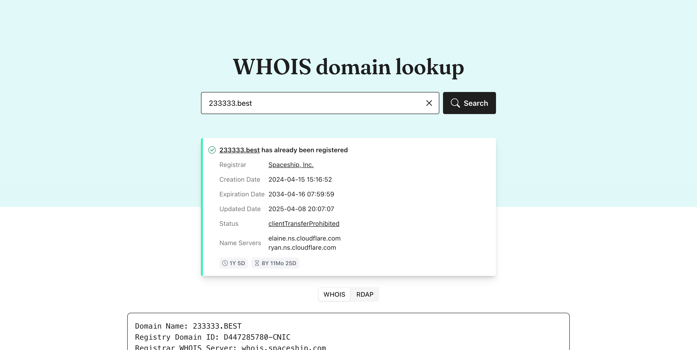
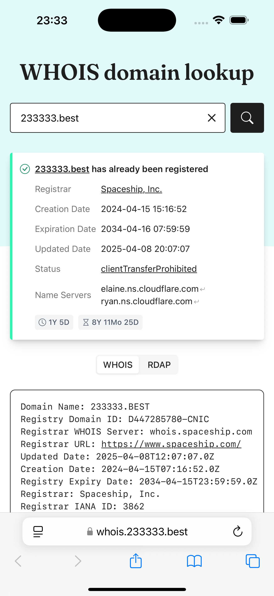
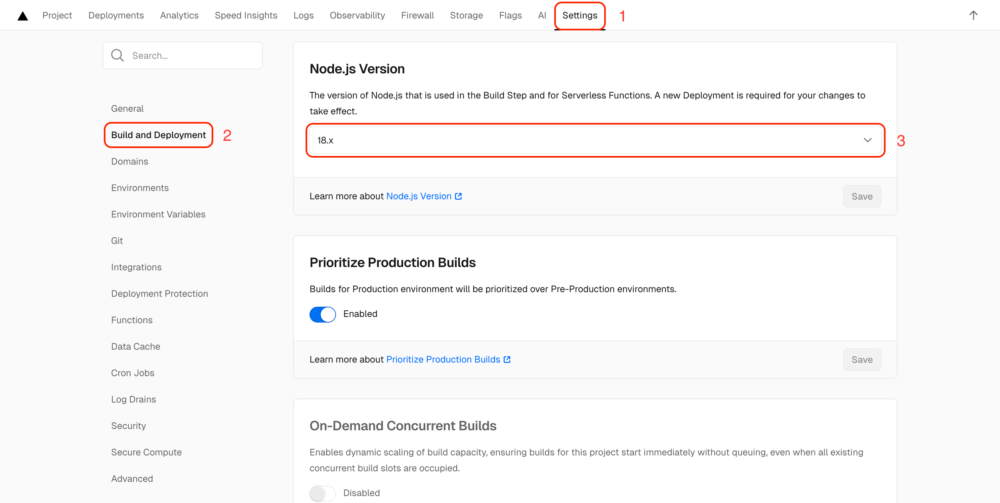
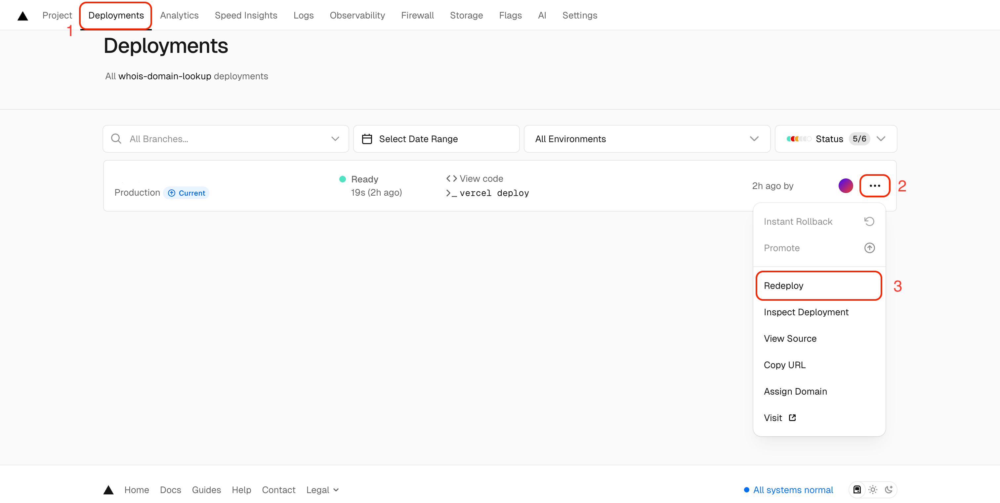

# WHOIS domain lookup

A simple WHOIS domain lookup website with strong TLD compatibility.

[简体中文 README](README.zh.md)

<table>
  <tr>
    <td>
      
    </td>
    <td>
      
    </td>
  </tr>
</table>

[Live Demo](https://whois.233333.best)

## Features

- Simple, Clear UI
- Strong TLD compatibility, including most ccTLDs and a few private domains
- WHOIS and RDAP support
- Display age, remaining days, and other information
- Highlight url and email in raw data
- API support

## Deployment

### Vercel

[](https://vercel.com/new/clone?repository-url=https%3A%2F%2Fgithub.com%2Freg233%2Fwhois-domain-lookup&demo-title=WHOIS%20domain%20lookup&demo-description=A%20simple%20WHOIS%20domain%20lookup%20website%20with%20strong%20TLD%20compatibility.&demo-url=https%3A%2F%2Fwhois.233333.best)

> [!WARNING]
> Due to the issue [#573](https://github.com/vercel-community/php/issues/573) in the `vercel-php` project, you need to manually change the `Node.js Version` in the project settings to `18.x` and redeploy.

Step 1



Step 2



### Docker Compose

#### Deploy

```sh
mkdir whois-domain-lookup
cd whois-domain-lookup
wget https://raw.githubusercontent.com/reg233/whois-domain-lookup/main/docker-compose.yml
docker compose up -d
```

#### Update

```sh
docker compose down
docker compose pull
docker compose up -d
```

### Web Hosting

Requirements:

- PHP >= 8.0
- `intl` extension

Download the [release](https://github.com/reg233/whois-domain-lookup/releases/latest/download/whois-domain-lookup.zip), unzip it, and then upload it to the root directory of your website.

## Env Variables

| Key | Description | Example | Default |
| :-- | :-- | :-- | :-- |
| `DATA_SOURCE` | The data source for the lookup. <br> Options: `whois` , `rdap` , `all` . | `rdap` | `all` |
| `DEFAULT_EXTENSION` | The default extension when no extension is entered. | `net` | `com` |
| `SITE_TITLE` | Title of the website. | `WHOIS lookup` | `WHOIS domain lookup` |
| `SITE_DESCRIPTION` | Description of the website. | `A simple WHOIS domain lookup website.` | `A simple WHOIS domain lookup website with strong TLD compatibility.` |
| `SITE_KEYWORDS` | Keywords of the website. | `whois, rdap, domain lookup` | `whois, rdap, domain lookup, open source, api, tld, cctld, .com, .net, .org` |
| `BASE` | The `href` attribute of the `base` tag in HTML. | `/whois/` | `/` |
| `CUSTOM_HEAD` | The custom content to be inserted before the `head` closing tag in HTML. | `<style>h1{color:red}</style>` |  |
| `CUSTOM_SCRIPT` | The custom content to be inserted before the `body` closing tag in HTML. | `<script>alert('Welcome')</script>` |  |
| `HOSTED_ON` | Name of the hosting platform. | `Serv00` |  |
| `HOSTED_ON_URL` | URL of the hosting platform. | `https://serv00.com` |  |

If you deploy using `web hosting`, you should modify the `config/config.php` file, like this:

```php
<?php
define("DATA_SOURCE", getenv("DATA_SOURCE") ?: "rdap");

define("DEFAULT_EXTENSION", getenv("DEFAULT_EXTENSION") ?: "net");

...
```

## API

URL: `https://whois.233333.best?domain=233333.best&json=1`

Method: `GET`

## TODO

- [ ] Fetch WHOIS data from web page
- [ ] Extract registrant information
- [ ] Improve reserved domain detection

## Thanks

- [WhoisQuery](https://github.com/GitHubPangHu/whoisQuery)
- [Gandi](https://whois.gandi.net)
- [WHO.CX](https://who.cx)

## Collaboration

If you know the missing WHOIS or RDAP server addresses for this project, feel free to collaborate with us!

If you encounter any issues, feel free to open a [new issue](https://github.com/reg233/whois-domain-lookup/issues).
